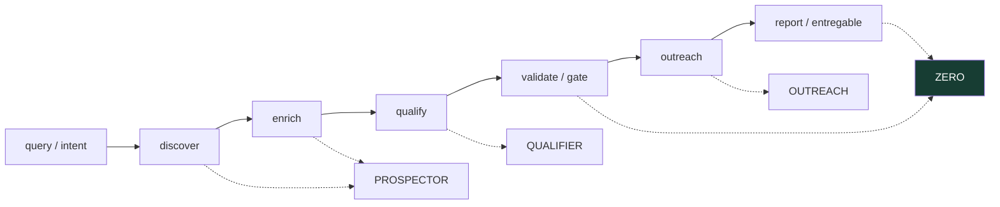
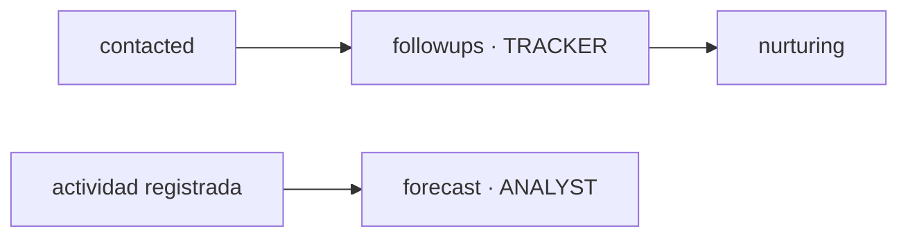

# Arquitectura

**ZERO** es el orquestador. No descubre ni escribe mensajes él mismo: compone una `TaskPayload` (JSON), la despacha al sub-agente correcto, recibe una `AgentResponse`, valida contra el gate de [[04 - CRM y Pipeline de Ventas]] y ensambla el entregable. Todo agente habla el mismo contrato sin importar el [[03 - Backends|backend]].

## El pipeline

Flujo documentado en el `README.md`:

**Acciones posteriores al pipeline** (no son parte del flujo de descubrimiento, se corren aparte — ver [[07 - CLI y Comandos]]):

## El orquestador: ZERO

- Vive en `zero/orchestrator.py`.
- Cerebro por defecto: **`claude-fable-5`** (`ZERO_MODEL` en `zero/config.py`). Ver [[03 - Backends]].
- Responsabilidades: **dispatch** (reparte tareas) · **validate** (aplica el gate) · **log** (registra cada cambio en memoria + CRM) · **follow-ups** · **forecast** · **deliverable** (ensambla la entrega).
- La aritmética del funnel **no** se delega al LLM: `project_funnel()` en `config.py` la calcula de forma determinista.

## Los sub-agentes

Cada uno es una clase en `zero/agents/` con su `_mock_result` (offline, determinista) y el camino real vía backend; su prompt de sistema está en `prompts/`. Hablan JSON (`AgentResponse`).

| Agente | Rol | Archivo |
|---|---|---|
| **PROSPECTOR** | Descubrimiento + enriquecimiento de leads (mock, LLM, o web real) | `agents/prospector.py` |
| **QUALIFIER** | Scoring 0–100 + match contra el ICP | `agents/qualifier.py` |
| **OUTREACH** | Primer mensaje por canal (email / WhatsApp / llamada en frío) | `agents/outreach.py` |
| **TRACKER** | Secuencias de seguimiento tras el primer toque (nudge → value → breakup) | `agents/tracker.py` |
| **ANALYST** | Juicio de tasas de conversión para el forecast (la aritmética la hace `config.py`) | `agents/analyst.py` |

### Agentes de extensión (más allá del pipeline base)

| Agente | Rol | Archivo |
|---|---|---|
| **CONCIERGE** | Agente conversacional: redacta la respuesta cuando un lead contesta (WhatsApp/email) | `agents/concierge.py` |
| **MEDIABUYER** | Gestor de campañas Meta Ads con Claude (analiza CPL/gasto/leads vs CPL objetivo) | `agents/mediabuyer.py` |
| **PITCHWRITER** | Redacta el pitch de venta — creativo y distinto cada vez | `agents/pitchwriter.py` |

## El contrato (`zero/contracts.py`)

Las dataclasses **son** la interfaz entre ZERO y los sub-agentes:

- **`TaskPayload`** — unidad de trabajo que ZERO despacha (`agent`, `client_id`, `client_tier`, `instructions`, `data`, `constraints`, `task_id`).
- **`AgentResponse`** — la respuesta estructurada del sub-agente (`status: done|partial|error`, `result`, `notes`). Es **defensiva**: tolera JSON desprolijo de modelos reales (lista pelada → `{"leads": [...]}`, envoltorio faltante, status inválido).
- **`Lead`** — lead normalizado (`company`, `role`, `channel`, `name`, `email`, `phone`, `domain`, `source`, `score`, `icp_reasons`). `key()` da identidad estable para de-dup y chequeo de recontacto.

> [!note]
> El `README.md` nombra el pipeline `discover → enrich → qualify → validate → outreach → report`; el `CLAUDE.md` lo resume como `discover → qualify → validate → outreach → follow-up → forecast`. Son la misma cadena vista con distinto detalle (enrich es parte de discover; follow-up/forecast son las acciones posteriores).
